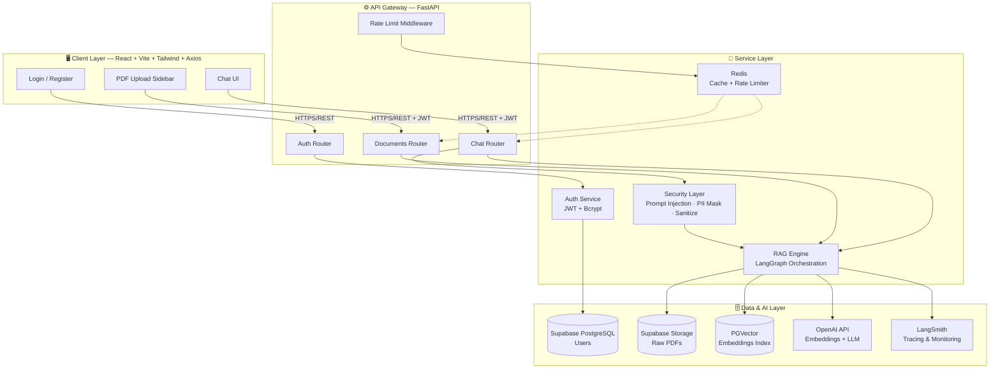
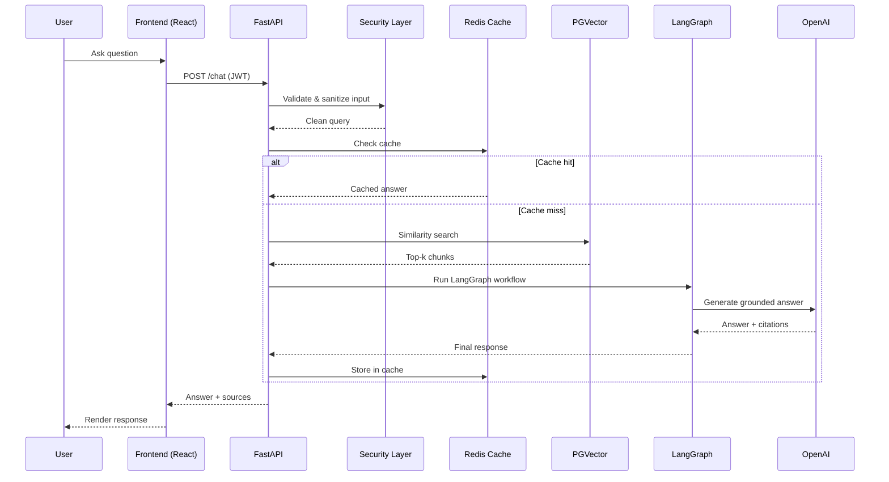

<div align="center">

# 🧠 Production RAG

### A Secure, Production-Ready Retrieval-Augmented Generation Platform

Ask questions grounded in your own documents — with enterprise-grade security, caching, and observability baked in from day one.

[](https://www.python.org/)
[](https://fastapi.tiangolo.com/)
[](https://react.dev/)
[](https://www.langchain.com/)
[](https://www.langchain.com/langgraph)
[](https://www.postgresql.org/)
[](https://redis.io/)
[](https://supabase.com/)
[](https://openai.com/)
[](LICENSE)
[](CONTRIBUTING.md)

[Features](#-features) • [Architecture](#-architecture) • [Installation](#-installation) • [API Reference](#-api-reference) • [Security](#-security) • [Deployment](#-deployment)

</div>

---

## 📖 Overview

**Production RAG** is a full-stack Retrieval-Augmented Generation application that lets users upload PDF documents, automatically ingests and embeds them into a vector database, and answers natural-language questions **grounded in that content** — complete with source citations.

Unlike most RAG demos, this project is built with production concerns front and center: JWT-based authentication, prompt-injection defense, PII masking, rate limiting, response caching, and full LLM observability via LangSmith.

> Built to demonstrate real-world AI engineering practices — not just a LangChain quickstart.

---

## ✨ Features

| Category | Capabilities |
|---|---|
| 🔐 **Authentication** | User registration, login, JWT-based auth, protected routes |
| 📄 **Document Ingestion** | PDF upload, automatic processing, text chunking, embedding generation |
| 🔍 **Retrieval** | Vector similarity search (PGVector), reranking, source-grounded retrieval |
| 🤖 **Generation** | LangGraph-orchestrated workflow, OpenAI LLM responses, inline source citations |
| 🛡️ **Security** | Prompt injection detection, context sanitization, PII masking, Redis rate limiting |
| ⚡ **Performance** | Redis response caching, optimized vector search, reranked retrieval |
| ☁️ **Storage** | Supabase Storage for raw PDFs and metadata |
| 📊 **Observability** | Full request/response tracing via LangSmith |
| 💻 **Frontend** | Login/Register pages, chat interface, PDF upload sidebar, citation display |

---

## 🏗️ Architecture

### System Architecture



### RAG Pipeline Flow

```mermaid
flowchart LR
    A[📄 User Uploads PDF] --> B[☁️ Supabase Storage]
    B --> C[⚙️ PDF Processing<br/>Text Extraction]
    C --> D[✂️ Chunking]
    D --> E[🧬 Embedding Generation<br/>OpenAI Embeddings]
    E --> F[(🗄️ PGVector<br/>Index Storage)]

    F --> G[🔎 Retriever<br/>Top-k Similarity Search]
    G --> H[📊 Reranker<br/>Relevance Scoring]
    H --> I[🕸️ LangGraph Workflow<br/>Orchestration + Guardrails]
    I --> J[🤖 OpenAI<br/>Grounded Answer Generation]
    J --> K[✅ Answer + Source Citations]
    K --> L[👤 Returned to User]
```



### Chat Query Sequence



---

## 🧰 Tech Stack

<table>
<tr>
<td valign="top" width="25%">

**Backend**
- FastAPI
- Python
- LangChain
- LangGraph
- SQLAlchemy
- Passlib / Bcrypt

</td>
<td valign="top" width="25%">

**Frontend**
- React
- Vite
- Tailwind CSS
- Axios
- React Router

</td>
<td valign="top" width="25%">

**Data & Storage**
- Supabase PostgreSQL
- PGVector
- Supabase Storage
- Redis

</td>
<td valign="top" width="25%">

**AI & Ops**
- OpenAI (LLM + Embeddings)
- LangSmith (Tracing)
- JWT Authentication

</td>
</tr>
</table>

---

## 📁 Project Structure

**Backend**

```
app/
├── api/          # Route handlers (auth, chat, documents)
├── auth/         # JWT issuing/validation, password hashing
├── cache/        # Redis caching layer
├── core/         # App config, settings, constants
├── database/     # SQLAlchemy models & session management
├── graph/        # LangGraph workflow definitions
├── logging/      # Structured logging setup
├── middleware/   # Rate limiting, auth, error handling
├── models/       # Pydantic schemas
├── rag/          # Chunking, embedding, retrieval, reranking
├── security/     # Prompt injection detection, PII masking, sanitization
├── services/     # Business logic layer
├── validators/   # Input validation
└── main.py       # FastAPI application entrypoint
```

**Frontend**

```
Frontend/
├── src/
│   ├── components/  # Reusable UI components
│   ├── pages/       # Login, Register, Chat pages
│   ├── context/     # Auth/session context providers
│   └── api/         # Axios client & API calls
```

---

## 🚀 Installation

### Prerequisites

- Python 3.11+
- Node.js 18+
- A [Supabase](https://supabase.com/) project (PostgreSQL + Storage + PGVector enabled)
- A [Redis](https://redis.io/) instance (local or hosted)
- An [OpenAI](https://platform.openai.com/) API key
- (Optional) A [LangSmith](https://smith.langchain.com/) account for tracing

### 1. Clone the repository

```bash
git clone https://github.com/<your-username>/production-rag.git
cd production-rag
```

### 2. Backend setup

```bash
cd app
python -m venv venv
source venv/bin/activate      # Windows: venv\Scripts\activate

pip install -r requirements.txt

cp .env.example .env          # then fill in your credentials

uvicorn main:app --reload --port 8000
```

### 3. Frontend setup

```bash
cd Frontend
npm install

cp .env.example .env          # then fill in your API base URL

npm run dev
```

The app will be available at `http://localhost:5173`, with the API running at `http://localhost:8000`.

---

## 🔑 Environment Variables

**Backend (`app/.env`)**

| Variable | Description |
|---|---|
| `DATABASE_URL` | Supabase PostgreSQL connection string |
| `SUPABASE_URL` | Supabase project URL |
| `SUPABASE_KEY` | Supabase service role / anon key |
| `SUPABASE_STORAGE_BUCKET` | Bucket name for PDF storage |
| `OPENAI_API_KEY` | OpenAI API key for embeddings & completions |
| `JWT_SECRET_KEY` | Secret used to sign JWTs |
| `JWT_ALGORITHM` | Algorithm for JWT signing (e.g. `HS256`) |
| `JWT_EXPIRE_MINUTES` | Access token expiry, in minutes |
| `REDIS_URL` | Redis connection string |
| `LANGSMITH_API_KEY` | LangSmith API key for tracing |
| `LANGSMITH_PROJECT` | LangSmith project name |

**Frontend (`Frontend/.env`)**

| Variable | Description |
|---|---|
| `VITE_API_BASE_URL` | Base URL of the FastAPI backend |

---

## 📡 API Reference

| Method | Endpoint | Description | Auth Required |
|---|---|---|---|
| `POST` | `/register` | Register a new user | ❌ |
| `POST` | `/login` | Authenticate and receive a JWT | ❌ |
| `POST` | `/documents/upload` | Upload a PDF for ingestion | ✅ |
| `POST` | `/chat` | Ask a question grounded in uploaded documents | ✅ |

### Example — Register

```bash
curl -X POST http://localhost:8000/register \
  -H "Content-Type: application/json" \
  -d '{
    "email": "jane.doe@example.com",
    "password": "SecurePass123!"
  }'
```

### Example — Login

```bash
curl -X POST http://localhost:8000/login \
  -H "Content-Type: application/json" \
  -d '{
    "email": "jane.doe@example.com",
    "password": "SecurePass123!"
  }'
```

**Response**

```json
{
  "access_token": "eyJhbGciOiJIUzI1NiIsInR5cCI6IkpXVCJ9...",
  "token_type": "bearer"
}
```

### Example — Upload a document

```bash
curl -X POST http://localhost:8000/documents/upload \
  -H "Authorization: Bearer <access_token>" \
  -F "file=@research_paper.pdf"
```

### Example — Chat with your documents

```bash
curl -X POST http://localhost:8000/chat \
  -H "Authorization: Bearer <access_token>" \
  -H "Content-Type: application/json" \
  -d '{
    "question": "What are the key findings in the uploaded paper?"
  }'
```

**Response**

```json
{
  "answer": "The paper identifies three key findings: ...",
  "sources": [
    { "document": "research_paper.pdf", "page": 4, "score": 0.91 },
    { "document": "research_paper.pdf", "page": 7, "score": 0.87 }
  ]
}
```

---

## 🛡️ Security

Production RAG treats the LLM as an untrusted component in the pipeline and applies multiple layers of defense:

| Layer | Purpose |
|---|---|
| 🚫 **Prompt Injection Detection** | Screens user input and retrieved context for injection patterns before they reach the LLM |
| 🧼 **Context Sanitization** | Strips and neutralizes unsafe content pulled from ingested documents |
| 🕵️ **PII Masking** | Detects and masks personally identifiable information in inputs/outputs |
| 🔐 **JWT Authentication** | Stateless, signed tokens protect all non-public routes |
| ⏱️ **Redis Rate Limiting** | Throttles requests per user/IP to prevent abuse and control cost |

---

## ⚡ Caching & Performance

- **Redis Response Caching** — frequently asked questions are cached to reduce LLM API calls and latency
- **Vector Search** — PGVector-backed similarity search for fast, relevant retrieval
- **Reranking** — a secondary relevance pass improves precision beyond raw vector similarity

---

## 📊 Observability

All LLM calls, retrieval steps, and LangGraph workflow executions are traced end-to-end with **LangSmith**, enabling:

- Full request/response tracing
- Latency breakdowns per pipeline stage
- Debugging of retrieval quality and prompt behavior

---

## 🖼️ Screenshots

> _Add screenshots below to showcase the UI._

**Login Page**

`<!-- screenshot: login-page.png -->`

**Chat Interface**

`<!-- screenshot: chat-interface.png -->`

**PDF Upload Sidebar**

`<!-- screenshot: upload-sidebar.png -->`

**Source Citations**

`<!-- screenshot: source-citations.png -->`

---

## ☁️ Deployment

| Component | Suggested Platform |
|---|---|
| Backend (FastAPI) | Render, Railway, Fly.io, or AWS ECS |
| Frontend (React/Vite) | Vercel or Netlify |
| Database | Supabase (managed PostgreSQL + PGVector) |
| Storage | Supabase Storage |
| Cache | Redis Cloud / Upstash |

**Example: Backend Docker deployment**

```bash
docker build -t production-rag-api ./app
docker run -p 8000:8000 --env-file ./app/.env production-rag-api
```

**Example: Frontend build**

```bash
cd Frontend
npm run build
# Deploy the generated dist/ folder to Vercel/Netlify
```

---

## 🗺️ Future Improvements

- [ ] Multi-format document support (DOCX, TXT, HTML)
- [ ] Streaming chat responses (SSE/WebSockets)
- [ ] Multi-tenant workspaces
- [ ] Conversation history & memory
- [ ] Hybrid search (keyword + vector)
- [ ] Admin dashboard for usage analytics
- [ ] Automated evaluation suite (RAGAS / LangSmith evals)

---

## 🤝 Contributing

Contributions are welcome! To get started:

1. Fork the repository
2. Create a feature branch (`git checkout -b feature/your-feature`)
3. Commit your changes (`git commit -m "Add your feature"`)
4. Push to the branch (`git push origin feature/your-feature`)
5. Open a Pull Request

Please open an issue first to discuss significant changes.

---

## 📄 License

This project is licensed under the **MIT License** — see the [LICENSE](LICENSE) file for details.

---

<div align="center">

Built with ⚙️ FastAPI, ⚛️ React, and 🦜🔗 LangChain — engineered for production, not just a demo.

⭐ If you find this project useful, consider giving it a star!

</div>
